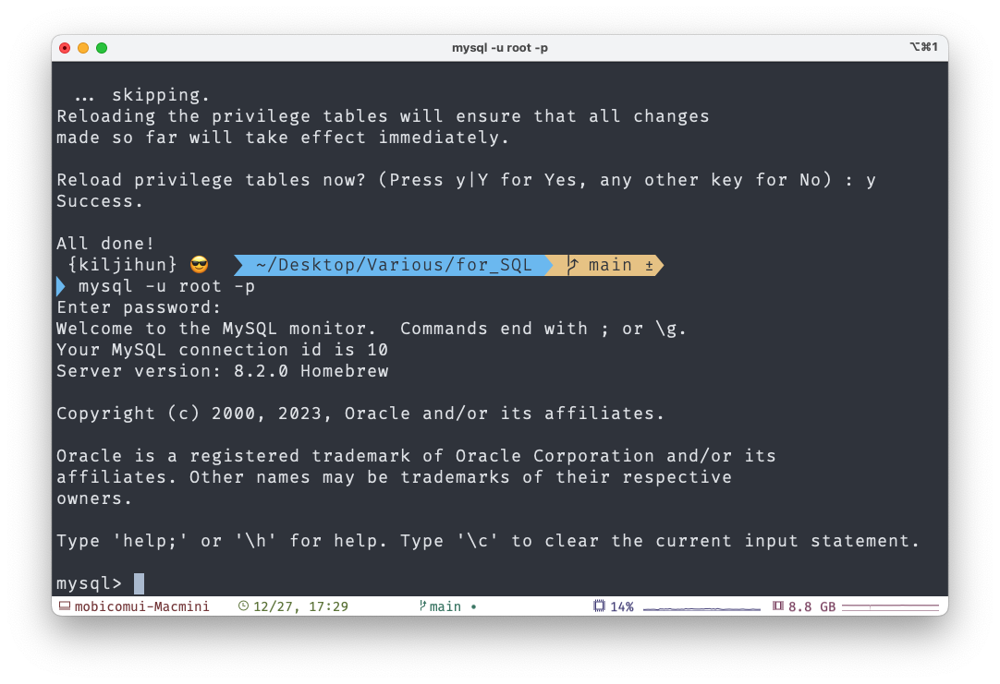

# for_SQL
SQL 코딩테스트, PCSQL 자격증을 위한 SQL 내용정리입니다. with MySQL

<p align="center">

**📢 Egoing Lee님의 [mySQL 강의][mysql]를 기반으로 정리합니다**  

[mysql]: https://www.inflearn.com/course/mysql-%EA%B0%95%EC%A2%8C
  
<br></br>    
# mySQL 설치(with M1 and homebrew)
***M1 기준으로 본 문서는 작성됨.***

## 설치
1. 먼저 homebrew 업데이트를 업데이트 해준다.
   (homebrew 설치는 검색 고고)
~~~
$ brew update
~~~

2. MySQL을 설치한다.
~~~
$ brew install mysql
~~~

3. MySQL을 스타트.
~~~
$ mysql.server start
~~~

4. 기본 설정을 건드려줘야 한다. 아래처럼 입력.
~~~
$ mysql.server start
~~~

5. 아래처럼 기본 설정에 대한 질문이 순서대로 나오는데 입맛대로 설정해준다.
```
- 비밀번호 복잡도 검사 과정
- 비밀번호 입력, 재확인 (루트 암호 설정) 
- 익명 사용자 삭제 (익명의 계정을 허용할 것인가)
- 원격 접속 허용하지 않을 것인가?
- test DB 삭제 (기본적으로 생성하는 test DB)
- previlege 테이블을 다시 로드? (현재까지 내용 저장?)
```

완료하면 **All done!** 메시지가 출력됨..//

6. MySQL 사용하기!
~~~
$ mysql -u root -p
~~~



위 사진처럼 뜨면 완료!
**CHEERS!**


ESCAPE 하는 법 : \q 

**return : Bye.**

# 목차 

- [데이터베이스 개요](<./데이터베이스개요.md>)
- [클라이언트(mysql monitor)](<./클라이언트(mysql monitor).md>)